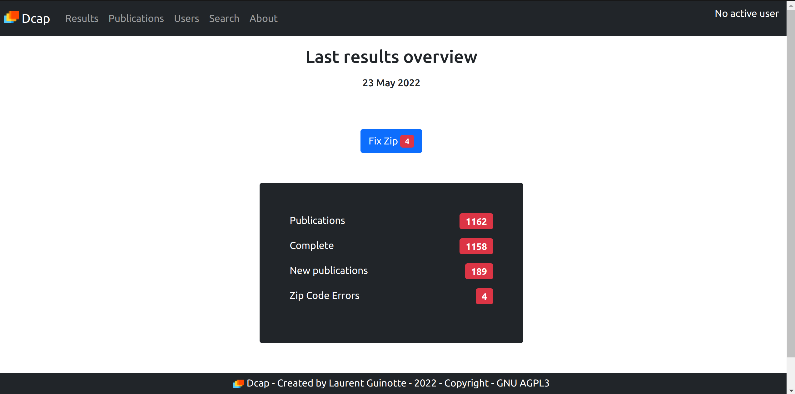
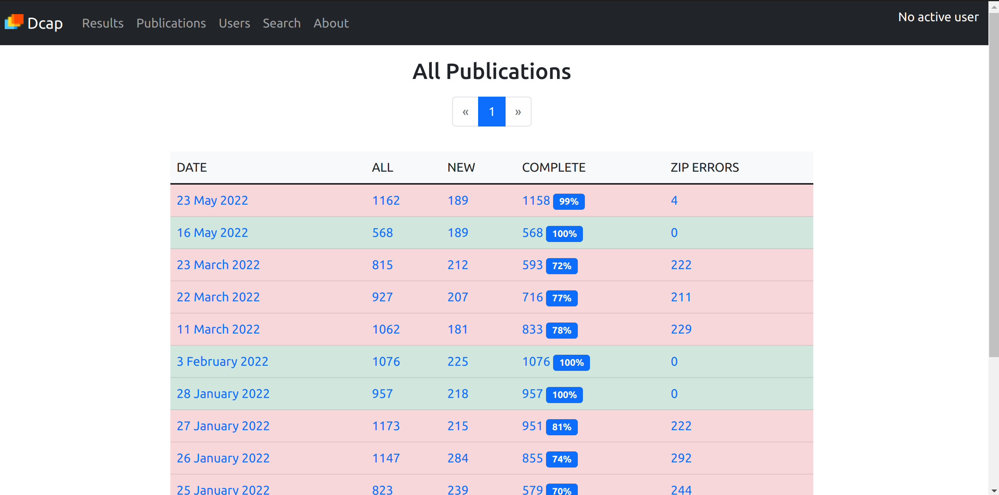
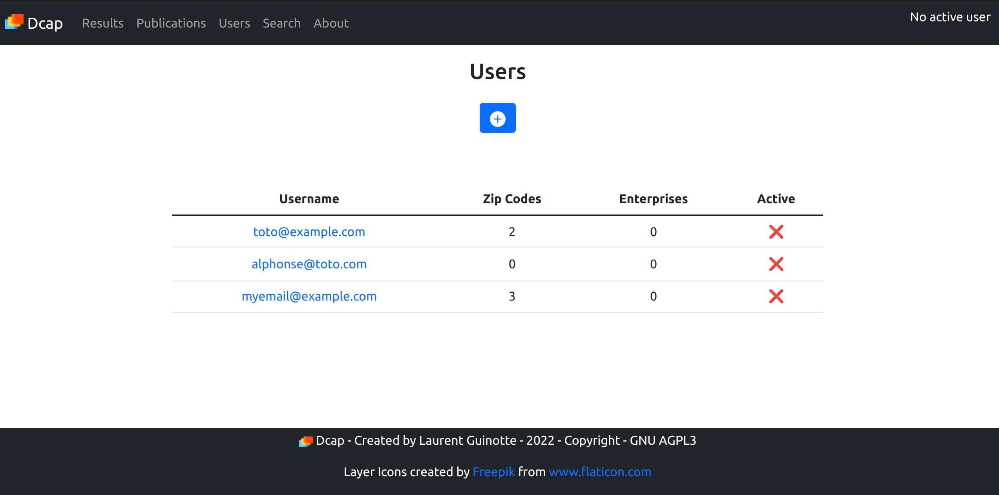
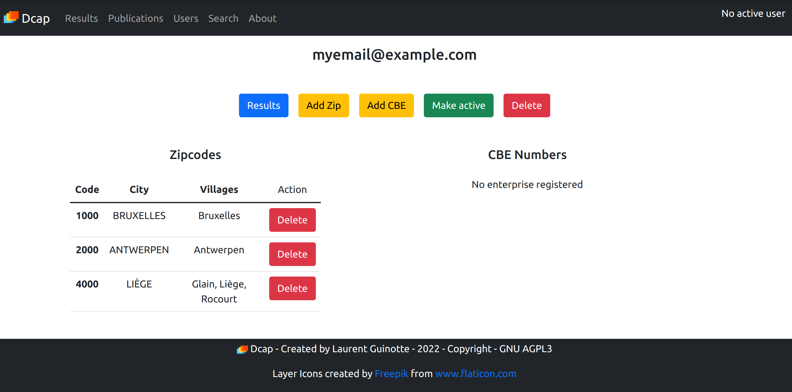
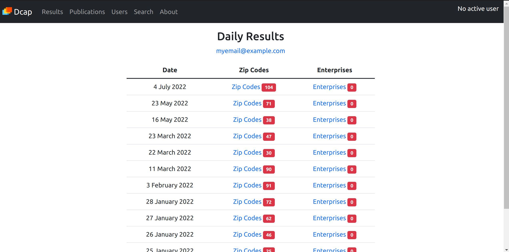

# YOCM

Your Own Company Monitor (Belgium)

- Monitor what happens to your companies of interest and / or located in a specific geographical area, with your own local and private client : Download and parse the daily publications of companies acts from the [_Moniteur Belge_](https://justice.belgium.be/fr/moniteur_belge), and register your companies of interest and/or specific zip codes.

- Access the results with a GUI (with your browser from a local server).

Current version : 0.12.0 - [see changes](https://github.com/loranger32/yocm/blob/main/CHANGELOG.md)

## 1. Introduction

Every Belgian company or association must publish some important acts, such as :

- incorporation
- appointment / resignation of members of the board 
- appointment / resignation of the auditor(s)
- change of the registered office
- dissolution / liquidation
- ...

 The [_Moniteur Belge_](https://justice.belgium.be/fr/moniteur_belge) is in charge of making these publications publicly available, and this is done on [this part of the website](https://www.ejustice.just.fgov.be/tsv_pub/tsv_sum_a_f.htm).

There, you can download a zip file with all publications as PDF documents.

**This project** allows you to download and parse the daily publications, store the results in a database and access them with a local front-end GUI in your browser.

Publications can then be accessed and sorted by entity CBE number, zip code, file name and publication date.

The front-end application allows you to manage multiple users, each with their own criteria,
and display the daily results according to these criteria.

For each publication, you get a direct link to the entity information's on the following websites:

- [CrossRoads Bank for Enterprises (CBE)](https://economie.fgov.be/en/themes/enterprises/crossroads-bank-enterprises) : useful general information's on the entity ;
- [Moniteur Belge](https://www.ejustice.just.fgov.be/tsv_pub/index_f.htm): all publications related to the entity ;
- [National Bank of Belgium](https://consult.cbso.nbb.be/): statutory accounts of the entity ;

The code is [available on GitHub](https://github.com/loranger32/Yocm)

## 2. Use cases

There are two main use cases :

### 2.1. Check publications of specified companies or associations

Each user can register the CBE number(s) of a selection of companies or associations.

Once the parsing is done, you can see if there are publications matching the selected companies or associations for a specific day.

### 2.2. Check the publications of companies or associations in selected cities (with zip codes)

Similar to the CBE number, each user can register a selection of zip code.

Once the parsing is done, the user can list the publications matching the registered zip code(s).

Useful if you want to know what's happening in a specific geographical area.

## 3. Two kinds of parsing

If you are only interested in following specific entities, you can do a basic parsing. It's pretty quick (less than an minute depending on your internet connection).

If you also want the zip code feature, the parsing requires _additional computing and time_ (10 - 20 minutes depending on your hardware).

### 3.1. Basic Parsing

An XML file ships with the daily zip archive provided by the _Moniteur Belge_, and makes the link between a publication and the relevant entity, using the CBE number.

The engine just links the CBE number to the publication in the DB, and its done. 

Additionally, with the data publicly available from the CBE, that is stored in your local DB, you get additional info such as the address, denominations, branch.

And with the CBE number, you get the useful links to the various websites where you can get more information's about each company or association.

### 3.2. Zip code parsing

Unfortunately, _if you make use of the free data set from the CBE_, it is only updated monthly.

That means that for every publication concerning a _new company or association_ (typically, the act of incorporation), the data won't be available yet in your local DB.

The additional links do work, _but if your goal is to be informed about companies / associations creations in a specific geographical area, you need to read all new publications :-(_

That's where the zip code parsing feature comes in : the parsing engine reads all publications for which it doesn't find a correspondence in your local DB, and search it for a valid zip code (OCR process).

If one is found, the engine links it with the publication. If not, it marks the publication with an error, and you get the ability to inspect it with the GUI, and assign the zip code yourself with the publication on the screen.

Currently, there are between 0 to 10 errors per day to fix, usually less than 5. Most of the time, the errors are due to :

- a handwritten zip code
- a badly scanned document
- the zip code not being mentioned on the document

And there little that can be done to overcome these issues.

## 4. Setup

**WARNING**: The program has been tested on Ubuntu 19.10 and above, and should work on MacOs. It does not work on Windows (at least for now).

### 4.1. Required data set from the CBE

You'll need to download the data publicly available on the
[website of the CrossRoads Bank for Enterprises (CBE)](https://economie.fgov.be/en/themes/enterprises/crossroads-bank-enterprises/services-everyone/cbe-open-data).

In order to use these data, you'll also need to register and accept the terms of use.

There is a free version, updated monthly, and a paid version, updated daily.

The project has only been tested with the free monthly update version. You can download the updated data on the same website page, and the project ships with a small CLI utility to ease and automate the import and update of the data into the DB.

### 4.2. Dependencies :

- For basic parsing :

  - [Ruby 3+](https://www.ruby-lang.org)

  - [SQLite3](https://www.sqlite.org/) + CLI tool

  - _optional_ : to easily switch from ruby version, and to avoid privilege issues when installing ruby libraries (gems),
    you are encouraged to use a ruby version manager like [rbenv](https://github.com/rbenv/rbenv), [RVM](https://rvm.io/) or [asdf](https://github.com/asdf-vm/asdf)

- For zip Code parsing:

  - [ImageMagick](https://legacy.imagemagick.org/) version **6** required. You need to allow the treatment of PDF in the security policies. If it fits your security policy, in the file `policy.xml`, just comment out the line :

    ~~~ xml
      <policy domain="coder" rights="none" pattern="PDF" />
    ~~~

    This file is usually found at `/etc/ImageMagick6/policy.xml`.

  - [Tesseract-OCR](https://github.com/tesseract-ocr/tesseract), for OCR with the languages `fra`, `nld` and `deu`;

  - [Ghostscript](https://www.ghostscript.com/index.html) for converting PDF to PNG via ImageMagick (usually included in linux distros)

Run `ruby yocm/yocm.rb --check-setup` to check if all dependencies are met.

### 4.3. Configuration - ENV variables

#### 4.3.1 Required

- The following environments variables MUST be set :

  - `CBE_WEBSITE_LOGIN` and `CBE_WEBSITE_PASSWORD` which are your credentials for the [website of the CrossRoads Bank for Enterprises (CBE)](https://economie.fgov.be/en/themes/enterprises/crossroads-bank-enterprises/services-everyone/cbe-open-data). It will be used to ease the setup of the required CBE data into your local Database.
  
  - **GUI** : `SESSION_SECRET` must be a string of at least 64 bytes and should be randomly generated.
  More info in the [Roda::RodaPlugins::Session documentation](http://roda.jeremyevans.net/rdoc/classes/Roda/RodaPlugins/Sessions.html). It is used by the GUI only.
  You can generate such a string by issuing the following command in a terminal at the root of the project : `rake random`

#### 4.3.2 Optional

  - `BASE_DB_PATH` an absolute path to an existing directory where you want to store your production and development DB. If the variable is not set, these 2 DB's are created inside the `db` directory (and are ignored by git due to the .gitignore file).

  - `DB_BACKUP_DIR` an absolute path to your backup directory (without the trailing slash). Used by the `rake db:backup` command.

#### 4.3.3 Use a `.env` file

You can set the environment variables as you see fit, but there is a simple way : just create a
file called `.env` (mind the dot) at the root of the project, with the required environment variables in plain text. Thanks to the [`dotenv` ruby gem](https://github.com/bkeepers/dotenv), they will automatically be picked up when launching any of the scripts.

_This file will be ignored by git due to the .gitignore file. Don't change this setting !_

### 4.4 Final steps

- Install the dependencies listed above ;

- Clone or download the repository ;

- Go to the root of the repository ;

- Run `ruby yocm/yocm.rb --check-setup` to ensure all dependencies are met ;

- Run `bundle install`. This will install all the required Ruby libraries from the [rubygems website](https://rubygems.org);

- Run `rake db:migrate`. This will setup the required tables in the production database.

- If you want to run the tests and/or use the development database, you can run :
  - `rake db:test:migrate`
  - `rake db:dev:migrate`
  - or simply `rake db:all:migrate` which will migrate all three databases

## 5. Usage

The main entry point is : `yocm/yocm.rb`

~~~ bash
me@my_computer in my/local/path/yocm $ ruby yocm/yocm.rb --help
Usage: ./yocm/yocm.rb [options]
    -b, --days-back=DAYSBACK         Select number of days before (0-30)(with -e or --engine)
    -d, --debug-mode                 Set logger to debug level (with -e or --engine)
    -e, --engine                     Run parsing engine
    -g, --gui                        Launch the GUI
    -m, --manage-update              Launch CBE data update manager
    -s, --skip-parsing               Don't parse zip code (with -e or --engine)
        --local-files                Process local publication files, no download
        --png-present                PNGs already presents, don't do the conversion (no download)
        --devdb                      Interact with the development DB
        --import-cbe                 Import CBE data from data/cbe directory (need a full datatset)
        --update-cbe                 Update CBE data from data/cbe directory (need an update dataset)
        --import-zipcodes            Import zip codes
        --clean-cbedata              Delete all CBE data from database (but will leave the publications and zip codes data)
        --extract-versions           Compare extract version numbers of DB, Data folder and CBE website
        --fetch-update=NUMBER        Fetch update dataset nr NUMBER from the CBE website
        --check-setup                Check if all required dependencies are satisfied
    -v, --version                    Show version
    -h, --help                       Show this message

~~~

### 5.1. Importing data

#### 5.1.1 Zip Codes

- import the **zip codes**. The required csv file is already present under `yocm/data/zip_codes/zip_codes.csv`.  Just run :

~~~shell
$ ruby yocm/yocm.rb --import-zipcodes
~~~

  Source for zip codes is [here on the Bpost.be website](https://www.bpost.be/fr/outil-de-validation-de-codes-postaux), but the csv file obtained from this website needs some tweaks and cannot just be dropped in and imported in the database.

  It's a one time operation, and there will be little to no need to import them again.

#### 5.1.2 CBE Data

##### 5.1.2.1 Using the update manager

Simply run `$ ruby yocm/yocm.rb -m` or `--manage-update` and YOCM will check the data available in your DB, in your local directory and on the website of the CBE.

If it's the first time you use it, it will propose to download the data, unzip it and upload it in the DB.

Otherwise it will check if you still have the latest available data in your DB, and propose to perform the required actions for you.

Most of the time, the update manager is all you need.

It is _strongly advised_ to run the update manager once a month, because the CBE publishes monthly updates.

Import can take up to an hour depending on your hardware. Update usually less than a minute.

##### 5.1.2.2 Do it manually

If for any reason you don't want or can't use the update manager, the manual steps are the following :

- import the __CBE data__:
  
  - download the latest _full_ zip file from the [CBE website](https://economie.fgov.be/en/themes/enterprises/crossroads-bank-enterprises/services-everyone/cbe-open-data) and unzip it into the `yocm/data/cbe` folder. You should have all the various csv files. Required files are :

    - address.csv

    - denomination.csv

    - enterprise.csv

    - code.csv

    - meta.csv

  - Then run : `$ ruby yocm/yocm --import-cbe`

- update the __CBE data__

  Free updated CBE data is published monthly (every first Sunday of the month).

  You can choose from a `full` data set with the latest data, or a smaller data set called `update` with only the data to delete and the new data to insert. The latter takes way less time.

  The datasets obtained from the CBE are marked with an extract number (see the meta.csv file). If you already have the before to last data extract (e.g. new data set extract number is 102, and you have 101), then you can simply download the last `update` zip file from the [CBE website](https://economie.fgov.be/en/themes/enterprises/crossroads-bank-enterprises/services-everyone/cbe-open-data), and unzip it in the same directory as for a full import(`yocm/data/cbe_data`).

  Then run : `$ ruby yocm/yocm.rb --update-cbe`

__How to check data extract number ?__

The easy way is to run `ruby yocm/yocm.rb --extract-version`. It will tell you what are the data set versions in your DB, in your local folder and on the CBE website.

Note that if the extractNumbers do not fit together, an error will be raised. You have two options :

- clean the cbe data from the local DB, download and unzip the last `full` zip file, and import again;

  ~~~bash
  $ ruby yocm/yocm.rb --clean-cbedata
  $ ruby yocm/yocm.rb --import-cbe
  ~~~

- Update from the very next data extract from the CBE website according to the data extract present in your local DB, until you reach the required version. **You'll need to process incrementally** : first download the next extract, update the DB, and repeat until the required extractNumber is reached. In other other words, _you cannot download all the missing zip files all at once and make an update_. If you are several versions behind, consider cleaning the local DB and perform a full import.

Please also note that only the 4 last extracts are available for download on the CBE website.

##### 5.1.2.3 Interacting with the development database

By default, the regular database will be used, which is probably your production database.

If you've setup the development database, you can interact with it with the `--devdb` flag :

~~~bash
$ ruby yocm/yocm.rb --import-cbe --devdb
~~~

### 5.2. Running the engine

If you perform the parsing daily and want the zip code feature, simply run `$ ruby yocm/yocm.rb -e` (or `--engine`).

If you are not interested in the zip code feature, you can skip the parsing of the zip codes with the `-s` flag : `$ ruby yocm/yocm.rb -e -s`.

Much faster, but no zip codes for publications of new companies and associations.

If you missed some days, the `-b`, `--days-back=` option is what you need: just pass it an integer representing the number of days to go back in time.

~~~bash
$ ruby engine/engine.rb -e -b1 # Yesterday
$ ruby engine/engine.rb -e -b2 # The day before yesterday
$ ruby engine/engine.rb -e -b7 # One week ago
~~~

Be aware that :

- You can only parse one day at a time.
- Publications are only published from Monday to Friday. If you choose a week-end day, the engine will complain and raise an error.
- The _Moniteur Belge_ websites only holds 30 days of archives. So numbers greater than 30 will return a 404 error.

The `--local-files` and `--png-present` flags are mostly used during development when an error occurs during PDF conversion or parsing the PNG files. **Don't use the `--days-back=` flag** when using any of them, or you risk a directory mismatch.

- With the `--local-files` flag, there is no download of the archive from the website of the _Moniteur Belge_. The engine assumes to find the unzipped PDF files in the `/yocm/data/unzipped` folder. It will then process normally and start converting the PDF's into PNG's.
- With the `--png-present` flag, there is no download + there is no conversion of PDF's into PNG files. The engine starts immediately with the OCR part and expects to find the PNG files in `/yocm/data/png`.

## 7. Using the GUI

To launch the GUI, pass the `-g` flag (or `--gui`) : `ruby yocm/yocm.rb -g` and open your browser at `http://localhost:9292`

You can also start a development server, which reloads all the files when a file is changed. It also displays debugging info when an error occurs : `$ rake ds`

**EDIT: the following section needs an update, buts still gives an overall overview of the current features**

This is the home page, showing the global results of the last parsing.

Click the publications tab to see the list of all publications, sorted by day.

 

A red row indicates that there are zip code errors to fix. If you use the `-s ` flag (skip zip code parsing), there will be quite a lot of errors. If you don't need zip codes, you don't need to care about these errors.

Click on the Users link to manage users.

You can add a user by using an email address.   

To manage an individual user, simply click on its email address.

From there, you can add CBE numbers and zip codes to track.

You can also access the user's specific matching results by clicking the "results" button.

 

To easily access the results of a specific user, you can make this user "active" by clicking the "make active" button on the user's page.

When it's done, you will see the email address of this specific user on the top right corner. And you can now click on the "Results" button to directly access the user's results.

### Caveats

#### The GUI is a _local_ front-end

The local GUI is meant to be a (hopefully) friendly local companion to the project. It's by no means a _web app_, and is not designed to be made accessible on the scary Internets. The GUI is meant to run on a local machine on which you do have total and exclusive control.

#### No authentication, no authorization

The concept of a user is a convenience to help you manage multiple profiles on the same DB. There are no authentication, nor authorization mechanism in place. That means that everyone who is able to start the server or access the DB can access the data of all users (e.g. selected zip codes and CBE numbers).

## 9. How to update the project

Simply issue a `git pull` command from the root of the project.

Changes to the GUI and the engine shouldn't introduce breaking change, but that can happen, so you are strongly advised to review the changes before updating the project.

But **changes to the database schema could break something**, or at a minimum require you to issue a `rake db:all:migrate` so you absolutely need to review the `changelog.md` file before using the updated version.

Please also note that some changes in the database schema are required due to changes in the data schema of the CBE itself. Sometimes, it's impossible to update the data from the CBE without applying the changes first.

Don't forget to backup your local DB before any of these operations :

 ~~~bash
 me@my_computer in /path/to/yocm/dir $ rake db:backup
 ~~~

It's a wrapper for the `pg_dump -F p your_database_name > your_backup_file`

This command assumes an environment variable `DB_BACKUP_DIR` to be set with an absolute path to your backup directory (without the trailing slash). 

Then you can run the following command to update the DB schema : `$ rake db:all:migrate`

# Known issues

Due to database design, it is currently impossible to delete zip codes from the zip codes table if you have a user with registered zip codes. It is more a feature than a bug : it prevents you from accidentally deleting zip codes for which users have a subscription.

Workaround 2: remove all zip codes subscriptions from all users, delete and upload zip codes again, then recreate subscriptions.
Workaround 1: delete all users with registered zip codes and recreate them.

# Roadmap

The app is functional, but here are the things that should be done / fixed (in no particular order) :

- Engine: send email with results
- Engine: add some guard clause when selecting multiple incompatible options for running the engine
- Engine - GUI: notify user when a subscribed entity is deleted from the db
- GUI : allow to add an entity to the follow list from the results page
- GUI - i18n: French, Dutch and English (currently mix of English and French)
- GUI: add tests
- GUI:  allow update cbe data set from the gui
- Doc: document the engine processing and the various data directories

# Contribution

See a bug or something you want to improve ? Great :

- Fork the repository ;
- Create your own branch (git checkout -b my-new-feature) ;
- Make your feature addition or bug fix ;
- Add tests for it (important);
- Commit on your own branch ;
- Push to the branch (git push origin my-new-feature) ;
- Create a new pull request ;

Or simply open an issue on GitHub.

## License

GNU AGPL 3 - See the LICENCE file
